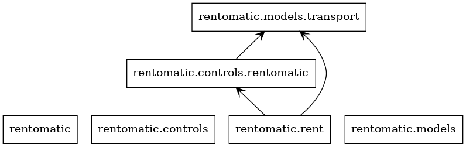

# Rent-o-matic

## Prerequisites

Tested with Python 3.x.

No external library dependencies.

## Usage

Run in the `rentomatic` directory:

```bash
python rent.py
```

This will print a list of available commands.

## Status

This will start a 'Rent-o-matic', and initialize it with 1-10 random available transports,
plus one random transport that is already rented out (i.e. not available).

The interactive interface allows to rent and return transports through their ids.
All commands are available through the `help` command.

Done
*  Implementation with user textual interaction
*  Vehicle renting with payments (no validity checks)
*  Different types of transports (each as separate sub-class of `Transport` class)
*  Inventory of existing, available transports
*  Add a random vehicle that is rented out (not available)
*  Ability to return a rented vehicle (mileage not added)

Not done within 2 hours timeframe:
*  Money handling (change, check for price vs. available money)
*  UML diagrams (added later: see [classes.png](classes.png) and [packages.png](packages.png))
*  Unit test

Additional ideas for future improvements:
*  Make output more readable
*  Make IDs shorter for usability
*  Enable interaction with multiple users
*  Facilitate packaging with Python `setuptools`
*  Allow specification of initial inventory through command line interface or configuration file

## Structure



